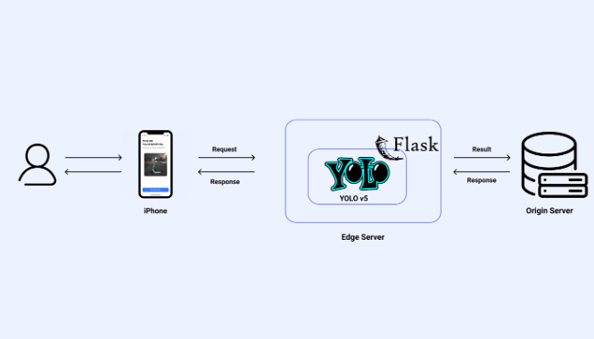

# 모바일 애플리케이션 엣지환경 구축

## 프로젝트 소개

최근 몇 년 동안 거리에서 공유 자전거, 전동 킥보드로 대표되는 ‘퍼스널 모빌리티’ 를 쉽게 마주할 수 있다. 일반적으로 정해진 승강장에서 여러 사람들이 함께 이용하는 여타 교통수단과 달리, ‘퍼스널모빌리티’는 원하는 목적지까지 부담 없이 이동할 수 있는 개인 맞춤형 모빌리티라는 점에서 도심 보행자들에게 인기를 끌고 있다. 이로 인해, 운전자들이 보도 위, 특히 시각장애인들을 위해 설치된 점자블록 위에 무단 주·정차해 시각장애인들의 통행을 방해하고 사고를 유발하는 경우가 빈번히 발생한다.

본 프로젝트는 공유 전동 킥보드를 반납하려는 사용자가 iOS 애플리케이션으로 촬영된 반납하려는 장소 이미지 기반으로 전동킥보드와 점자블록를 인식하여 점자블록 위에 무단 주·정차를 차단하는 기술을 구현하고자 한다.

이를 달성하기 위한 첫번째 목표로 전동 킥보드와 점자블록 이미지를 라벨링을 통해 데이터 셋을 제작한다. 두 번째 목표로 위에서 획득한 데이터 셋을 딥 러닝 모델에 학습시켜 빠른 시간 안에 전동 킥보드, 점자블록을 인식할 수 있도록 한다. 마지막으로 최종 사용자의 QoE 를 위해 처리 할 데이터를 원 서버로 오프로딩 하기 전에 연산을 위한 데이터를 미리 엣지 서버에 저장하여 학습 된 딥러닝 모델을 사용하여, 연산 결과만 중앙집중식 데이터센터로 전송할 수 있도록 구현한다.

## 아키텍쳐 구조

  

